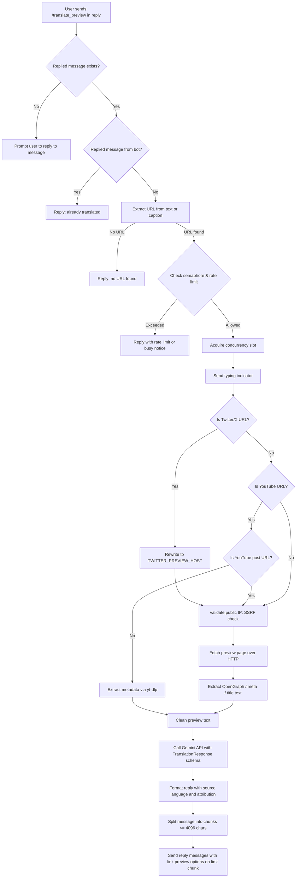
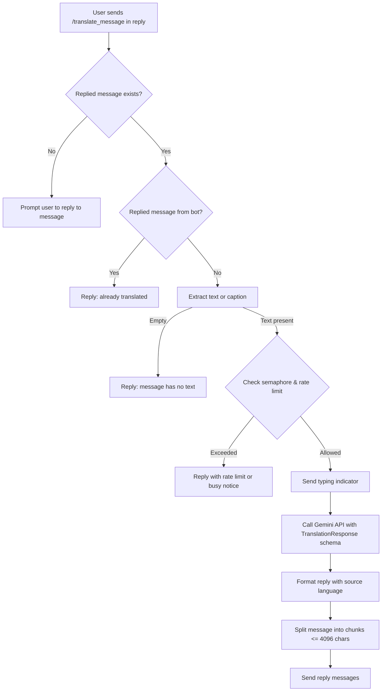

# Telegram translator

This context defines the architecture, data schemas, algorithms, prompt contracts, and operational rules required to recreate the telegram-translator bot from first principles.

## Purpose

This project is an asynchronous Python Telegram bot that translates messages and link previews using Google Gemini.
The bot provides two primary commands:
1. `/translate_preview` extracts and translates text from replied link previews.
2. `/translate_message` directly translates the text or caption of any replied message.

The design targets faithful translation that preserves tone, formatting, slang, and rhetorical effect.
It explains cultural nuances or wordplay through brief translator notes when necessary.
It defends against server-side request forgery (SSRF) and respects Telegram message length and rate limits.
Gemini provides translation through structured JSON output validation.
Pydantic validates every model response before publication.

## System model

The bot operates as an asynchronous polling service using `python-telegram-bot`.

### Preview translation flow (`/translate_preview`)



### Direct message translation flow (`/translate_message`)



## Repository layout

Every tracked file in this repository has a defined responsibility.

| Path | Responsibility |
| --- | --- |
| `app/__init__.py` | Package root. |
| `app/settings.py` | Environment variable validation and immutable Settings configuration object. |
| `app/preview.py` | URL extraction, Twitter rewriting, SSRF DNS validation, YouTube metadata fetching, and HTML preview extraction. |
| `app/gemini.py` | Gemini client management, prompt synthesis, structured Pydantic response models, and API translation requests. |
| `app/main.py` | Telegram bot application setup, command handlers, rate limiting, concurrency semaphores, message splitting, and polling loop. |
| `tests/conftest.py` | Pytest fixtures and shared mocks. |
| `tests/test_settings.py` | Behavioral tests for environment configuration loading and validation. |
| `tests/test_preview.py` | Behavioral tests for URL handling, preview scraping, and SSRF defenses. |
| `tests/test_gemini.py` | Behavioral tests for Gemini prompt construction and structured response handling. |
| `tests/test_main.py` | Behavioral tests for bot commands, rate limits, error paths, and message chunking. |
| `tests/README.md` | Test suite architecture, contract boundaries, and review-only specifications. |
| `systemd/telegram-translator.service` | User systemd service unit file with sandboxing and resource limits. |
| `pyproject.toml` | Project metadata, dependency specifications, and tool configurations. |
| `uv.lock` | Exact dependency lockfile managed by `uv`. |
| `.env.example` | Environment variable template with default values. |
| `.gitignore` | Ignores virtual environments, credentials, test caches, and temporary files. |
| `.python-version` | Pins the Python interpreter version for `uv`. |
| `AGENTS.md` | Authoritative development and behavioral instructions for agents. |
| `CONTEXT.md` | Authoritative technical specification, schemas, pipeline flow, and domain glossary. |
| `README.md` | User-facing installation, configuration, usage, and deployment guide. |

Keep the modules in `app/` on an acyclic dependency graph:
- `app/settings.py` is a foundation module with no project-internal imports.
- `app/preview.py` is an independent module with no project-internal imports.
- `app/gemini.py` depends only on `app.settings`.
- `app/main.py` orchestrates `settings`, `preview`, and `gemini`, and owns the bot lifecycle.

## Runtime requirements

The project requires Python 3.13 or newer.
Use `uv` for dependency management and execution.

Runtime dependencies:
- `google-genai>=1.55.0` for Gemini API access.
- `pydantic>=2.13.4` for structured response validation.
- `python-telegram-bot>=22.0` for the Telegram Bot API framework.
- `httpx>=0.28.0` for asynchronous HTTP requests.
- `beautifulsoup4>=4.14.0` for HTML and OpenGraph metadata extraction.
- `yt-dlp>=2026.3.17` for YouTube metadata extraction.
- `python-dotenv>=1.2.0` for loading `.env` configuration.

## Configuration

`python-dotenv` loads `.env` when the application starts.
The process environment can override any configuration variable.

| Variable | Default | Use |
| --- | --- | --- |
| `TELEGRAM_BOT_TOKEN` | None (Required) | Telegram bot authentication token from `@BotFather`. |
| `TELEGRAM_API_BASE_URL` | None | Optional custom Telegram Bot API endpoint URL. |
| `GEMINI_API_KEY` | None (Required) | Google Gemini API credential. |
| `GEMINI_API_BASE` | None | Optional custom proxy endpoint for Google Gemini. |
| `GEMINI_MODEL` | `gemini-3.8-flash` | Gemini model name used for translations. |
| `GEMINI_THINKING_LEVEL` | `medium` | Thinking budget level (`minimal`, `low`, `medium`, `high`). |
| `TARGET_LANGUAGE` | `English` | Target translation language. |
| `REQUEST_TIMEOUT_SECONDS` | `10.0` | Timeout in seconds for HTTP preview fetches and Gemini requests. |
| `TWITTER_PREVIEW_HOST` | `hitlerx.com` | Hostname used to rewrite Twitter/X URLs for preview scraping. |
| `YOUTUBE_COOKIES_PATH` | None | Optional path to cookie file for `yt-dlp`. |

The thinking level accepts `minimal`, `low`, `medium`, or `high`.
`REQUEST_TIMEOUT_SECONDS` must be a positive finite number.
`TWITTER_PREVIEW_HOST` must be a valid host without scheme or path components.
`TELEGRAM_API_BASE_URL` and `GEMINI_API_BASE` must be valid `http` or `https` URLs.

## Structured data schemas

### Translation response schema: `TranslationResponse`

The bot requires structured JSON outputs from Gemini using Pydantic validation:

```python
class TranslationResponse(BaseModel):
    translated_text: str = Field(description="The translated text.")
    source_language: str = Field(
        description="The full, capitalized English name of the original language of the text (e.g., 'Chinese', 'Japanese', 'Spanish', 'English'). If the text is already in the target language, still identify its language correctly."
    )
```

The model call configures:
- `temperature`: `0.0`.
- `response_mime_type`: `application/json`.
- `response_schema`: `TranslationResponse`.
- `thinking_config`: `types.ThinkingConfig(thinking_level=settings.GEMINI_THINKING_LEVEL.upper())`.
- Automatic function calling disabled explicitly via `build_content_config()` (`automatic_function_calling=types.AutomaticFunctionCallingConfig(disable=True)`).

When `response.parsed` is missing or invalid, the client raises `ValueError`.

## Translation pipeline and prompt contract

`translate_text()` builds prompts using source-specific labels:
- `"message"` labels content as a message.
- `"tweet"` labels content as a Twitter/X post.
- `"preview"` labels content as a web page preview.

The prompt enforces these translation rules:
1. Preserve handles, hashtags, names, URLs, emojis, and line breaks.
2. Produce a concise, natural translation that preserves the original meaning, tone, humor, slang, and rhetorical effect.
3. Avoid overly literal translations that lose rhetorical impact.
4. Handle wordplay naturally in the target language when possible.
5. Append one brief translator's note in the target language whenever text contains wordplay, puns, or non-obvious cultural context.
6. Label the note `"Translator's note:"` and place it after the translated text without other commentary.
7. Return text unchanged when it is already in the target language.

## Preview extraction and security

### URL extraction

`extract_urls()` scans text using `https?://[^\s<>()]+`.
It trims trailing punctuation marks from URLs:
`.,;!?)]}。．、，；：！？）］｝】」』》〉`.

### Twitter/X rewriting

The bot rewrites Twitter and X URLs to an alternative preview host.
This bypasses login walls and extracts full post text and media cards.
`is_supported_twitter_url()` detects hosts:
`twitter.com`, `mobile.twitter.com`, `x.com`, `mobile.x.com`.

It validates supported path patterns:
- `/<user>/status/<id>`
- `/<user>/status/<id>/photo/<n>`
- `/i/status/<id>`

`twitter_url_to_preview_url()` converts valid URLs to `https://{TWITTER_PREVIEW_HOST}/{path}`.

### YouTube preview handling

`fetch_youtube_preview_text()` routes YouTube URLs through dedicated handlers:
1. **Community posts (`/post/<id>`):**
   `fetch_youtube_post_text()` fetches page HTML using HTTPX.
   `extract_youtube_post_text()` parses the `<script>` tag containing `"discussionForumPosting"`.
   It decodes raw JSON to locate the `text` attribute.
2. **Standard videos, music, and shorts:**
   `_extract_youtube_preview_text()` runs `yt_dlp.YoutubeDL` in a background thread.
   When cookies are provided, it uses the `web` player client.
   Otherwise, it tries `ios`, `android`, and `web` player clients with `geo_bypass=True`.
   `format_youtube_preview_text()` formats the title, description, channel/uploader, and up to 30 tags.
3. **Fallback:**
   If `yt-dlp` metadata extraction fails, the bot falls back to standard HTTP HTML preview extraction.

### Generic preview extraction

`extract_preview_text()` extracts text from HTML pages using BeautifulSoup:
1. Checks meta tags: `og:description`, `twitter:description`, `description`.
2. Falls back to title tags: `og:title`, `<title>`.
3. Cleans extracted text: unescapes HTML entities, converts `<br>` tags to newlines, normalizes line breaks, and trims whitespace.

### Server-side request forgery (SSRF) defense

`validate_public_http_url()` defends against internal network scanning and request forgery:
1. Enforces `http` or `https` scheme.
2. Requires a valid hostname.
3. Resolves DNS addresses using `socket.getaddrinfo()` in a background thread.
4. Validates that every resolved IPv4 and IPv6 address is globally routable using `address.is_global`.
5. Rejects private, loopback, link-local, multicast, and reserved addresses with `ValueError`.
6. Follows up to 5 redirects (`MAX_PREVIEW_REDIRECTS = 5`), validating each intermediate destination URL before sending the request.

### Network boundaries and timeouts

Network requests enforce strict timeouts and error isolation:
- Preview page fetches use HTTPX with `timeout=settings.REQUEST_TIMEOUT_SECONDS` and `follow_redirects=False`.
- The bot handles redirects manually to validate destination IPs before each request.
- `yt-dlp` metadata extraction runs with `socket_timeout=settings.REQUEST_TIMEOUT_SECONDS`.
- Gemini API generation calls use `asyncio.wait_for(..., timeout=settings.REQUEST_TIMEOUT_SECONDS)`.
- When an external preview fetch or Gemini call fails or times out, the handler catches the exception, logs diagnostic details, and sends a user-facing failure response without crashing the bot daemon.

## Telegram bot operations

### Concurrency and rate limiting

The bot limits resource consumption across all incoming requests:
- **Concurrency limiter:**
  `BoundedSemaphore(3)` limits concurrent active translation jobs.
  Excess requests immediately receive:
  `"Too many translations are running. Please try again shortly."`
- **Rate limiter:**
  `reserve_translation_rate_slot()` maintains a 60-second sliding window in a `deque`.
  It permits up to 10 accepted requests per minute (`MAX_TRANSLATIONS_PER_MINUTE = 10`).
  Excess requests receive a retry delay:
  `"Translation rate limit reached. Please try again in {retry_after} seconds."`

### Telegram message handling

The bot observes Telegram platform limits and interaction conventions:
- **Message length limit:**
  Telegram limits messages to 4096 characters (`TELEGRAM_MESSAGE_LIMIT = 4096`).
  `split_telegram_message()` splits long translations at the last newline within 4096 characters.
  It falls back to a hard split only when no newline exists.
- **Link preview options:**
  For `/translate_preview`, the first reply chunk includes `LinkPreviewOptions(url=preview_url, prefer_large_media=True, show_above_text=False)`.
  Subsequent chunks omit link preview options.
- **Self-reply guard:**
  When a user replies to a message sent by the bot itself, the bot rejects the request:
  `"The message has already been translated"`.
- **Typing indicators:**
  The bot sends `ChatAction.TYPING` while translations are in progress.
- **Command menu:**
  `configure_bot_commands()` registers bot commands across default, private chat, and group chat scopes.

### Response contracts matrix

The bot defines explicit reply outcomes for all input states and failure conditions:

| Trigger | Condition | Bot reply text | Quoted | Link preview |
| --- | --- | --- | --- | --- |
| `/translate_preview` | Message is not a reply | `Please reply to a message containing a URL to translate its preview` | No | None |
| `/translate_preview` | Replied message authored by bot | `The message has already been translated` | Yes | None |
| `/translate_preview` | Replied message contains no URL | `Could not find a URL in the replied message.` | No | None |
| `/translate_preview` | Concurrency semaphore locked | `Too many translations are running. Please try again shortly.` | Yes | None |
| `/translate_preview` | Rate limit window saturated | `Translation rate limit reached. Please try again in {retry_after} seconds.` | Yes | None |
| `/translate_preview` | Preview fetch fails | `Could not fetch text from the replied preview message.` | Yes | None |
| `/translate_preview` | Translation call fails | `Could not translate this preview.` | Yes | None |
| `/translate_preview` | Successful translation with URL | `Translation from {source_language} for {source_url}:\n\n{translated_text}` | Yes | Attached to first chunk |
| `/translate_preview` | Successful translation without URL | `Translation from {source_language} for replied preview:\n\n{translated_text}` | Yes | Attached to first chunk |
| `/translate_message` | Message is not a reply | `Please reply to a message to translate its text` | No | None |
| `/translate_message` | Replied message authored by bot | `The message has already been translated` | Yes | None |
| `/translate_message` | Replied message has no text | `The replied message has no text to translate.` | No | None |
| `/translate_message` | Concurrency semaphore locked | `Too many translations are running. Please try again shortly.` | Yes | None |
| `/translate_message` | Rate limit window saturated | `Translation rate limit reached. Please try again in {retry_after} seconds.` | Yes | None |
| `/translate_message` | Translation call fails | `Could not translate this message.` | Yes | None |
| `/translate_message` | Successful translation | `Translation from {source_language}:\n\n{translated_text}` | Yes | None |

## Service deployment

The repository includes a user systemd service file at `systemd/telegram-translator.service`.

Configuration details:
- Runs as a user systemd unit (`WantedBy=default.target`).
- Assumes the repository lives at `%h/telegram-translator`.
- Restarts on failure after 5 seconds (`Restart=on-failure`, `RestartSec=5s`).
- Restricts memory to 256 MB (`MemoryMax=256M`).
- Limits CPU quota to 100% (`CPUQuota=100%`).
- Sandboxes execution with `ProtectSystem=full`, `PrivateTmp=true`, `NoNewPrivileges=true`, and network family restrictions.

### Service hardening and resource limits

The systemd user unit enforces strict process confinement:

| Directive | Value | Purpose |
| --- | --- | --- |
| `MemoryMax` | `256M` | Caps total memory consumption to prevent memory leaks from starving the host. |
| `CPUQuota` | `100%` | Prevents CPU starvation of other user processes. |
| `PrivateTmp` | `true` | Isolates `/tmp` to prevent tampering with other processes. |
| `ProtectSystem` | `full` | Mounts `/usr`, `/boot`, and `/etc` read-only. |
| `NoNewPrivileges` | `true` | Prevents privilege escalation. |
| `RestrictAddressFamilies` | `AF_INET AF_INET6 AF_UNIX` | Restricts socket types to IPv4, IPv6, and local UNIX domain sockets. |
| `RestrictRealtime` | `true` | Disables real-time scheduling. |
| `SystemCallArchitectures` | `native` | Restricts system calls to the native architecture. |

## Glossary

**LinkCleaner**:
A client, bot, or service that removes tracking parameters from URLs or provides clean embed links.

**Preview host**:
An alternative frontend service (such as `hitlerx.com` or `fxtwitter.com`) that generates OpenGraph metadata for Twitter/X posts.

**Server-side request forgery (SSRF)**:
A vulnerability where an application fetches remote resources from attacker-supplied URLs without restricting network destinations.

**Sliding window rate limit**:
A rate limiting algorithm that counts timestamps in a fixed-duration sliding window to throttle request volume.

**Thinking level**:
A Gemini configuration parameter that controls reasoning token budgets (`minimal`, `low`, `medium`, `high`).

**Translator's note**:
A concise contextual explanation appended to a translation to clarify wordplay, puns, or cultural references.
