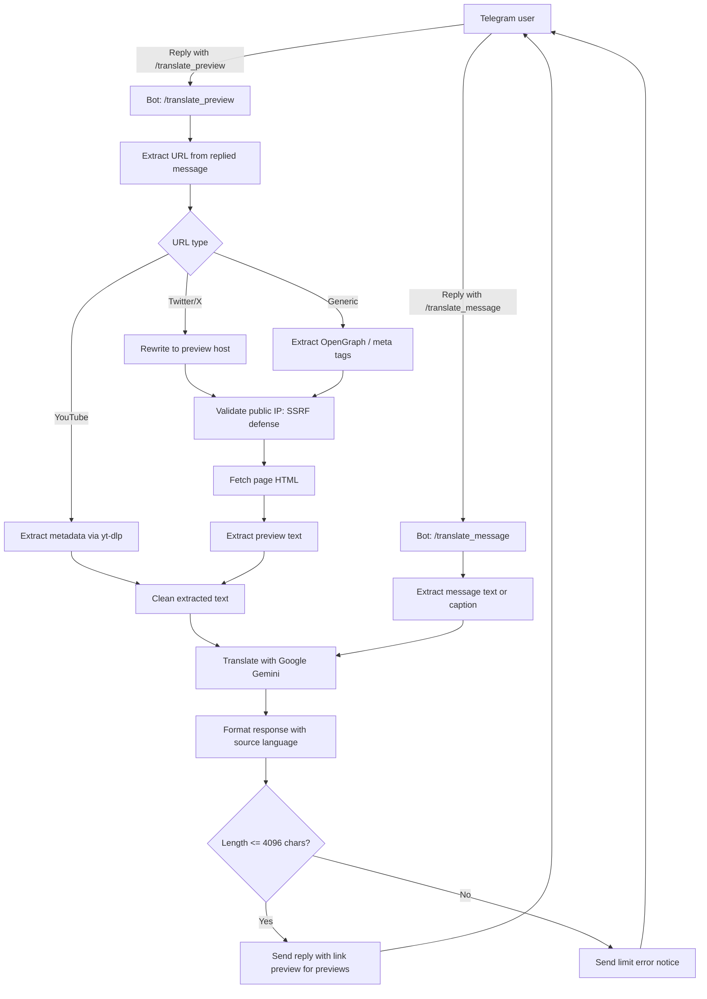

# Telegram translator

A Python Telegram bot that translates messages and link previews using Google Gemini.

## Pipeline overview



## Features

- **Preview translation:** Translate text from replied link previews, including Twitter/X posts, YouTube metadata, and generic web pages.
- **Direct message translation:** Translate the text or caption of any replied message directly.
- **Twitter/X preview rewriting:** Rewrite Twitter/X status links to an alternative preview host to extract complete post text and media cards.
- **YouTube metadata extraction:** Extract title, description, channel, and tags using `yt-dlp` for YouTube videos, and scrape full text from YouTube community posts.
- **SSRF defense:** Resolve hostnames and verify all IP addresses are globally routable before fetching remote preview pages.
- **Structured output:** Validate translation responses against Pydantic schemas using Gemini JSON mode.
- **Concurrency and rate limits:** Limit running translations with a concurrency semaphore and enforce a sliding window rate limit.
- **Systemd user service:** Run the bot continuously as a sandboxed systemd user service.

## Prerequisites

- [uv](https://github.com/astral-sh/uv) - Python package installer and resolver.
- Python 3.13 or newer.
- Telegram bot token from [@BotFather](https://t.me/botfather).
- Google Gemini API key from [Google AI Studio](https://aistudio.google.com/).

## Installation

1. Clone this repository:
   ```bash
   git clone https://github.com/gotenksIN/telegram-translator.git
   cd telegram-translator
   ```

2. Install dependencies with `uv`:
   ```bash
   uv sync
   ```

3. Create a `.env` file from the example:
   ```bash
   cp .env.example .env
   ```

4. Configure your credentials in `.env`:
   ```env
   TELEGRAM_BOT_TOKEN=your_telegram_bot_token_here
   GEMINI_API_KEY=your_gemini_api_key_here
   ```

## Configuration

Configure the bot using environment variables in `.env`:

| Variable | Default | Description |
| --- | --- | --- |
| `TELEGRAM_BOT_TOKEN` | Required | Telegram bot token from `@BotFather`. |
| `TELEGRAM_API_BASE_URL` | None | Optional custom base URL for the Telegram Bot API. |
| `GEMINI_API_KEY` | Required | Google Gemini API key. |
| `GEMINI_API_BASE` | None | Optional custom proxy URL for the Gemini API. |
| `GEMINI_MODEL` | `gemini-3.8-flash` | Gemini model name. |
| `GEMINI_THINKING_LEVEL` | `medium` | Thinking budget level (`minimal`, `low`, `medium`, `high`). |
| `TARGET_LANGUAGE` | `English` | Target translation language. |
| `REQUEST_TIMEOUT_SECONDS` | `10` | Timeout in seconds for HTTP preview fetches and Gemini requests. |
| `TWITTER_PREVIEW_HOST` | `girlcockx.com` | Hostname for rewritten Twitter/X preview links. |
| `YOUTUBE_COOKIES_PATH` | None | Optional path to a cookies file for `yt-dlp`. |

## Usage

Start the bot locally:

```bash
uv run python -m app.main
```

The bot registers two commands in Telegram:

### `/translate_preview`

Reply to any message containing a URL to translate its preview:

```text
/translate_preview
```

- For Twitter/X links, the bot rewrites the URL to the configured preview host, fetches the preview page, and translates the post.
- For YouTube links, the bot extracts the title, description, and tags via `yt-dlp` instead of generic page descriptions.
  For YouTube community posts, it extracts the full post body.
- For all other links, the bot falls back to OpenGraph and meta tag extraction.
- Telegram link preview metadata is ignored because the Telegram Bot API does not expose resolved preview text to bots.

### `/translate_message`

Reply to any text or media caption to translate it directly:

```text
/translate_message
```

The bot takes the replied message text directly and translates it with Gemini.
This command does not extract URLs or fetch previews.

## Service deployment

A systemd user unit is available at `systemd/telegram-translator.service`.
It assumes the repository lives at `~/telegram-translator` on the target system.

1. Synchronize dependencies with frozen versions:
   ```bash
   uv sync --frozen
   ```

2. Copy the service unit to your user systemd directory:
   ```bash
   mkdir -p ~/.config/systemd/user
   cp systemd/telegram-translator.service ~/.config/systemd/user/telegram-translator.service
   ```

3. Reload the systemd user daemon and enable the service:
   ```bash
   systemctl --user daemon-reload
   systemctl --user enable --now telegram-translator.service
   ```

4. Check the service status:
   ```bash
   systemctl --user status telegram-translator.service
   ```

5. Enable lingering so the service runs after you log out:
   ```bash
   loginctl enable-linger "$USER"
   ```
